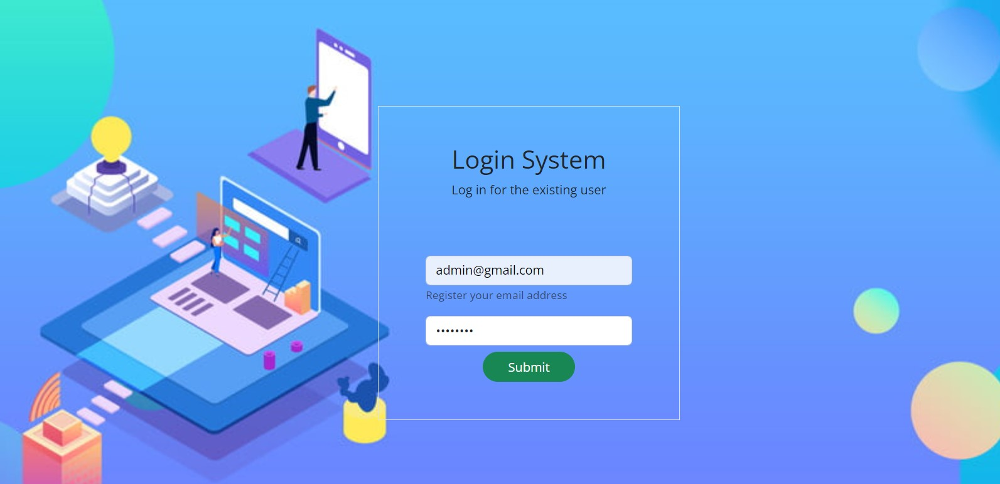
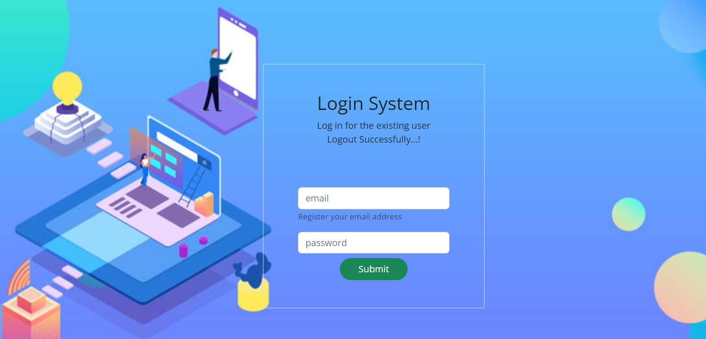

# Login Application
 - Built a Login application using Node.js and Express.js
 - Function: Basic login and logout with authentication (only authorized users can login)

## Dashboard for Sign In

 
 
## After Log In

## After Log Out

_Any doubts?  --> Ask me on [website](https://swasdas.github.io/) or [mail](mailto:swastik.sarc@gmail.com) me._
